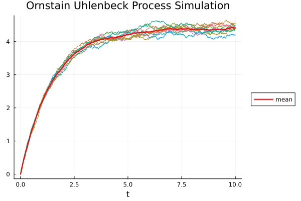

# Ornstain Uhlenbeck Process Simulation using Euler-Maruyama method

This repository contains the code to run simulations of the **Ornstain Uhlenbeck Process** and visualise the obtained results. <br>
*(Please note: The plot of the results will be saved as an image in your working directory)*

Here we are solving the following SDE : 
```math
dx_{t}=\theta (\mu -x_{t})\,dt+\sigma \,dW_{t}
```
<br>

The solving method used is the Euler-Maruyama method. https://en.wikipedia.org/wiki/Euler%E2%80%93Maruyama_method

The programming language used is Julia.


## Dependecies

To run this code you will need Julia installed in your pc. You can download it here : https://julialang.org/downloads/

This code uses 1 Julia package : Plots

To install this packages run this commands in the Julia terminal :

```Julia
  using Pkg
  Pkg.add("Plots")
```

## Run the code

To run any file use this command in terminal :

```Cmd
  julia /path/to/file.jl
```

## Some results

Here you can see the Resulting Plot for the following SDE:

```math
dx_{t}=\theta (\mu -x_{t})\,dt+\sigma \,dW_{t} 
with \theta = 0.7
\mu = 1.5
\sigma = 0.5
number_of_simulations = 10
```
<br>

 
